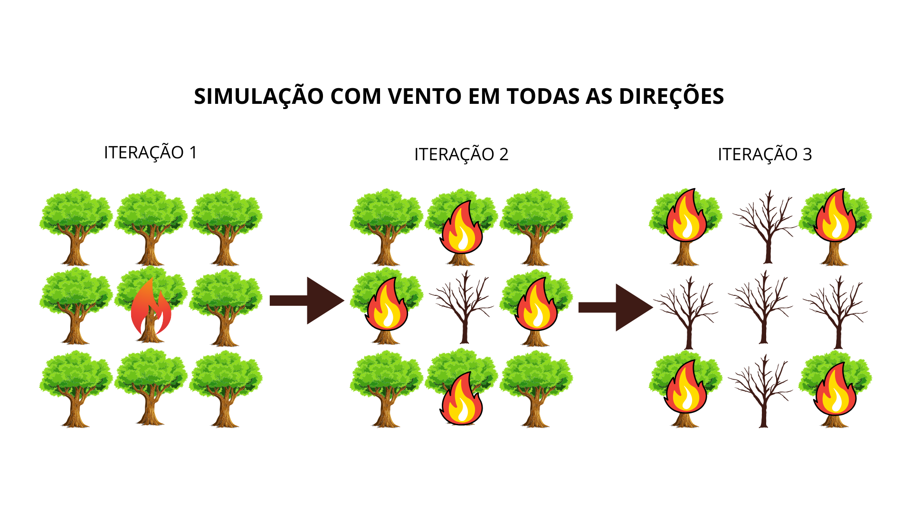
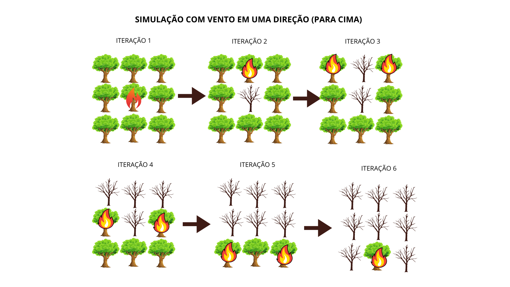

# Trabalho 1 AEDS - Simulação de Incêndio


Aluno: Arthur Batista Lage e Silva

Professor: Michel Pires da Silva

Disciplina: Algoritmos e Estruturas de Dados I

## Introdução

Esse trabalho de aquecimento tem o objetivo de simular a propagação de um incêndio em uma floresta e também a movimentação de um animal que está dentro dela.

Funcionamento geral do programa:
    
    - Possui um arquivo de configurações chamado "config.cpp", localizado na pasta "src", em que podem ser definidas propriedades que afetam a simulação, como o número máximo de iterações e a direção do vento que empurra o fogo.

    - Lê informações da floresta e incêndio de um arquivo de entrada chamado de "input.dat", que está localizado na raiz do projeto.
    
    - Cria uma matriz que representa a floresta.

    - Possui um loop no arquivo "main.cpp", que fará com que a simulação seja executada até uma quantidade máxima de iterações. Além disso, o loop será encerrado caso: o animal tenha sido encurralado pelo fogo, e não consiga escapar com sua segunda chance; ou caso todas as árvores tenham sido queimadas

    - O incêndio só se espalha após a movimentação do animal.

    - O resultado final da simulação fica no arquivo "output.dat", que é gerado após o fim da execução do programa.

## Metodologia

Explicação a cerca do funcionamento das classes e métodos do programa.

#### config.hpp

Arquivo que define variáveis de configuração que serão usadas no código:

DIRECTIONS_WIND: Vetor que pode receber as opções ["UP", "DOWN", "LEFT", "RIGHT"] para decidir para onde o vento espalhará o fogo inicialmente. Caso nenhuma opção seja fornecida, o fogo se espalha igualmente para todas as direçoẽs.

ITERATIONS: Quantidade máxima de iterações que o programa pode fazer. (Número inteiro)

DIRS: Vetor de pair<int, int> que armazena os valores das direções de propagação do fogo ou movimentação do animal. Essa variável não deve ser alterada, pois o funcionamento do programa depende dela. As posições desse vetor representam os valores para esquerda, cima, baixo e direita.

#### <a href="/src/config.cpp">config.cpp</a>

Aqui as variáveis criadas anteriormente recebem os valores que o usuário deseja utilizar no programa.

<a href="https://github.com/arthur-lage/trabalho1-aeds/blob/8760e36f888363afdbe49aee37aa02b62115cf7c/src/config.cpp#L10">Linha 10</a> : O vento inicia se espalhando para cima e para baixo da posição inicial do fogo.

<a href="https://github.com/arthur-lage/trabalho1-aeds/blob/8760e36f888363afdbe49aee37aa02b62115cf7c/src/config.cpp#L16">Linha 16</a>: Define que o máximo de iterações do programa será 50, então caso sejam necessárias mais de 50 iterações para terminar a simulação, ela será encerrada na iteração número 50

<a href="https://github.com/arthur-lage/trabalho1-aeds/blob/8760e36f888363afdbe49aee37aa02b62115cf7c/src/config.cpp#L20">Linha 20</a>: Define as direções que podem ser utilizadas para o fogo se propagar e para o animal se mover na floresta. (Não deve ser alterado)

#### <a href="/src/Animal.cpp">Animal.cpp</a>

Implementa funcionalidades para a classe animal.

Métodos principais:


<a href="https://github.com/arthur-lage/trabalho1-aeds/blob/8760e36f888363afdbe49aee37aa02b62115cf7c/src/Animal.cpp#L54">Linha 54</a>: Avalia as posições ao redor do animal, representando as casas que são visíveis por ele. O valor das casas são salvos em um vetor "animalsVision" e são utilizadas para a tomada de decisão na movimentação do animal. As casas -1 representam casas que estão fora do mapa da floresta.

<a href="https://github.com/arthur-lage/trabalho1-aeds/blob/8760e36f888363afdbe49aee37aa02b62115cf7c/src/Animal.cpp#L114">Linha 114-214</a>: Essa é uma das funções principais no programa. Ela é responsável por analisar as posições em volta do animal e adicionar as possibilidades de movimento em um vetor "possibleSteps", priorizando as posições que animal ainda não explorou. Se não houver posições ainda não exploradas válidas, o animal tenta pelos lugares que ele já passou.

Caso o animal tenha uma posição com água ao seu redor, ele se move para lá imediatamente. Se não, são avaliadas outras opções, como posições seguras ou árvores saudáveis, e em última instância, casas com árvores queimadas.

<a href="https://github.com/arthur-lage/trabalho1-aeds/blob/8760e36f888363afdbe49aee37aa02b62115cf7c/src/Animal.cpp#L216">Linha 216-240</a>: Função que mostra informações do animal e também sua posição atual na floresta. O animal será representado por um X na floresta.


### Estrutura do projeto

- Os arquivos de código (.cpp) estão localizados na pasta "src".

- Os arquvios de cabeçalho (.hpp) estão localizados na pasta "include".

- Os binários do projeto são gerados na pasta "build" após a compilação do programa.

### Movimentação do animal

O animal se move a cada iteração da simulação, escolhendo a melhor posição que ele encontrar:

(a) Melhor opção: posição com valor 4 (presença de água)
(b) Opções intermediárias: posição com valor 0 (área vazia) e posição com valor 1 (árvore saudável).
(c) Pior opção: posição com valor 3 (árvore queimada)

OBS: Caso o animal precise decidir entre 2 opções para se movimentar, ele vai selecionar alguma de forma aleatoria.

Ao alcançar uma posição com valor 4, essa posição se torna uma área vazia, e as posições ortogonalmente adjascentes se tornam 1 (árvores saudáveis).

### Segunda chance

Caso o animal seja atingido pelo fogo, ele receberá uma segunda chance de movimento, ficando imune ao fogo por uma iteração.

## Conclusão


## Compilação

A compilação pode ser feita usando o comando (é necessário possuir um compilador de C/C++ e também o make instalados):

```bash
# Dentro da raiz do projeto

make clean
make
make run
```

## Propagação do fogo

A propagação do fogo pode acontecer de duas maneiras: com vento em todas as direções ou somente em direções específicas. Isso precisa ser definido pelo usuário no arquivo "config.cpp".

### Sem vento em direções específicos

Na propagação em todas as direções, o fogo começa se espalhando para cima, para baixo, para esquerda e para a direta, assim como ilustrado na imagem abaixo.



### Com vento em uma direção específica

Na propagação com vento em direção específica, o fogo se espalha somente naquela direção inicialmente.



## Relação entre o tamanho do incêndio e quantidade de iterações

A partir das seguintes informações:

- Tamanho da floresta

- Presença de vento

- Proximidade das árvoes

- Quantidade de áreas seguras e áres com água (não permitem que o incêndio se espalhe através delas)

É possível estimar a quantidade de iterações necessárias para a conclusão da simulação.

## Ideia de melhoria na performance

Nesse projeto, para saber quais árvores vão pegar fogo na iteração atual, o programa percorre toda a matriz que representa o estado atual da floresta, marcando em uma outra matriz as posições que começarão a queimar. Uma ideia para melhorar o desempenho seria utilizar uma fila que armazenasse as coordenadas das árvores em chamas. Dessa maneira, não seria necessário utilizar FOR loops em cadeia para encontrar as posições.

## Autores

Arthur Batista Lage e Silva

<a href="https://github.com/arthur-lage">
    
</a>


<a href="https://linkedin.com">
    
</a>